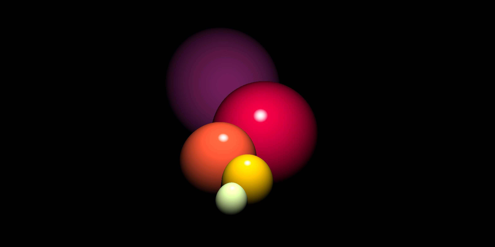
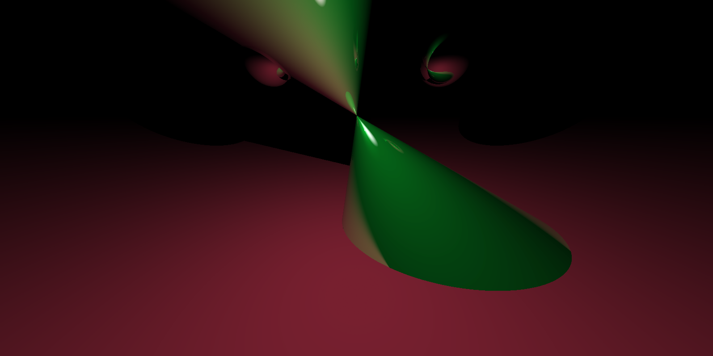
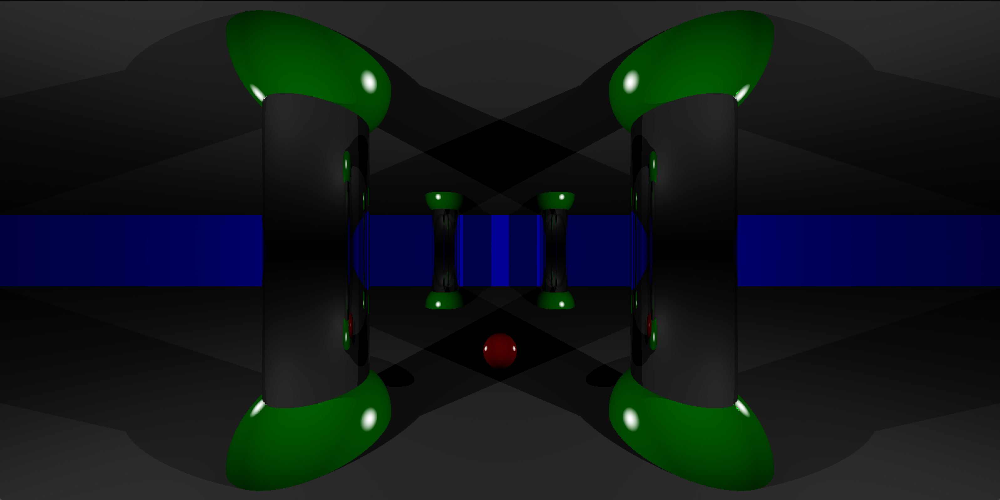

# RT
RT is an advanced rendering project of school 42. it was implemented in C, and we used the SDL graphic library to render the scenes. Every formula was implemtented without the help of any external libraries.  
Current objects that can be rendered are:
  - _Spheres_
  - _Cones_
  - _Infinite plans_
  - _Cylinders_

Material effects which can be used are:
  - _Scattering_
  - _Reflection_
  - _Refraction_

## Installation

Clone or download this repository and run `make` in command line while in the root of the repository. This command will build executables called `rtv1`.  
If you don't possess SDL, simply run `make sdl_install`.  
If you possess SDL but the program can't locate it, run `make sdl`.  

## Usage
### Scene file composition
__Material option (n)__:
  - Scatter: 1
  - Reflection: 2
  - Refraction: 3
  - Scalar Light Sensitive: 4

__Camera__: can only contain one in a scene, has a position and a direction propriety.  
_In file:_  `C: position: (X Y Z) | direction: (X Y Z)`    
__Light__: can contain multiple in a scene, has a position, a direction and an intensity propriety.  
_In file:_  `L: pos: (X Y Z) | direction: (X Y Z) | intensity: (N)`    
__Cone__: can contain multiple in a scene, has a position, an axe vector, radius, color and a material propriety.  
_In file:_  `O: cone top pos: (X Y Z) | axe_vector (normalized): (X Y Z) | radius: (N) | color: (R G B) | Material (n)`    
__Infinite Plan__: can contain multiple in a scene, has a distance to origin, normal, color, and a material propriety.  
_In file:_  `P: distance-origin: (N) | normal (normaized): (X Y Z) | color: (R G B) | Material (n)`    
__Sphere__: can contain multiple in a scene, has a position, radius, color and material propriety.  
_In file:_  `S: center-pos: (X Y Z) | radius: (N) | color: (R G B) | Material (n)`    
__Cylinder__: can contain multiple in a scene, has a position, direction, radius, height, color and a material propriety.  
_In file:_  `Y: position: (X Y Z) | direction [0-1]: (X Y Z) | radius: (N) | height: (N) | color: (R G B) | Material: (n)`    

### Run a scene

_./rtv1 scenes/file_

### Commands in scene

__'A' and 'D' keys__ are used to navigate on the _X axis_ by n unit.  
__'UP' and 'DOWN' arrow keys__ are used to navigate on the _Y axis_ by n unit.  
__'W' and 'S' keys__ are used to navigate on the _Z axis_ by n unit.  
__'+' and '-' keys__ are used to change the number of unit used to navigate.  
__'ESC' key__ is used to exit program properly.  

## Images

@Antoine: inspiration:
https://github.com/VolodymyrKuksa/RT#installation
https://github.com/wwatkins42/RT
https://github.com/ldehaudt/SimpleRaytracer
